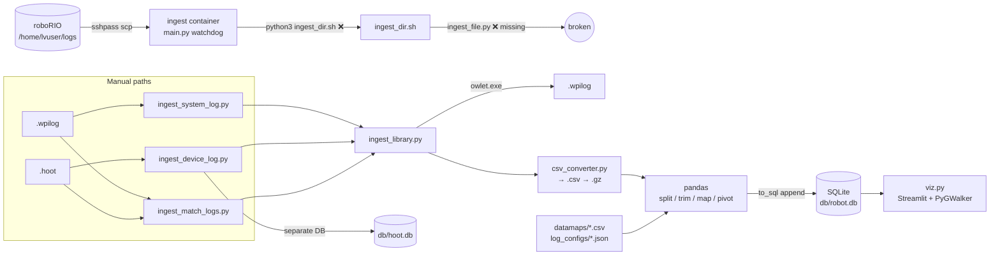
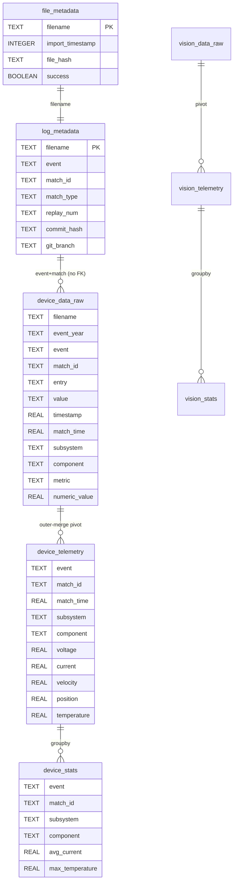
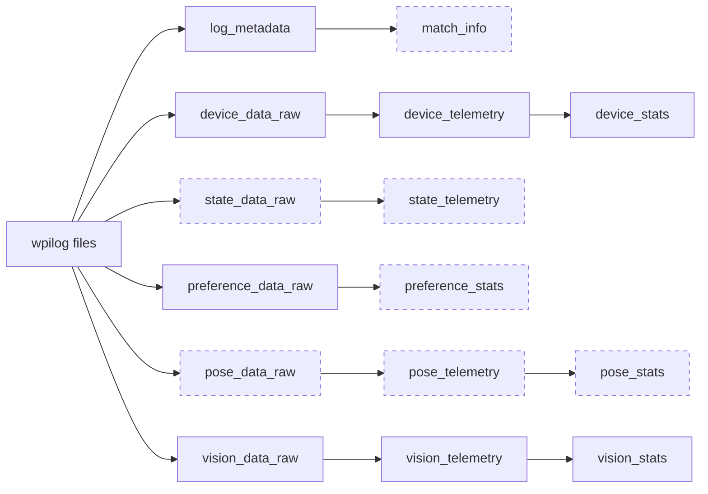
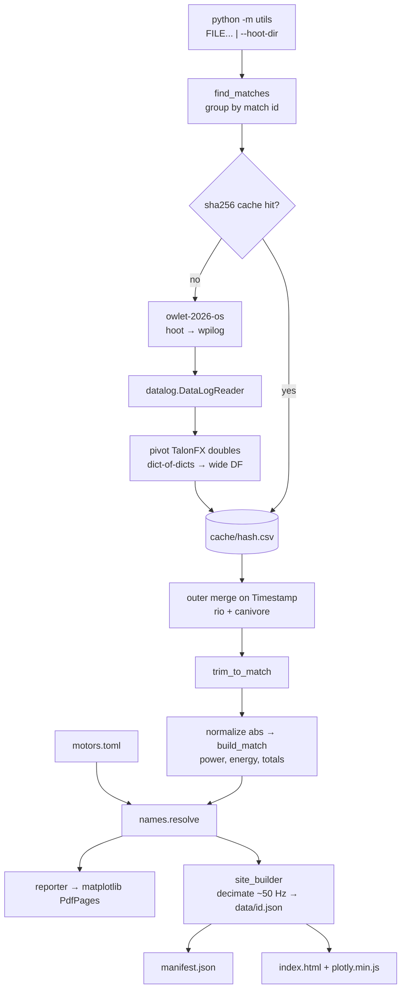

# 01 — Current Capabilities

This is an inventory of everything Flashpoint can do, or tries to do, across all branches. "Works?" reflects code reading plus test runs on exported branch snapshots (IgniteRobotics, 2026).

## 1. Capability matrix

| Area | Capability | Where | Works? |
|---|---|---|---|
| **Parsing** | Pure-Python WPILib DataLog reader. A vendored copy of WPILib's `printlog/datalog.py` example (WPILib, n.d.-b) | `main:datalog.py` | ✅ but slow |
| | wpilog → long CSV (`entry,type,value,timestamp`, quote char `\|`) → gzip | `main:csv_converter.py` | ✅ |
| | hoot → wpilog through CTRE `owlet` (CTR Electronics, n.d.-b) | `main:ingest_library.py:50` | ⚠️ Windows `.exe` only |
| | Per-OS and per-season owlet binaries (2024/2025/2026 × mac/linux/win) | `origin/development:ingest_library.py:54-62` | ⚠️ pinned to 2026, Linux build is x86-64 only |
| | hoot → wide DataFrame with a SHA-256 keyed CSV cache, TalonFX signals only | `origin/feature/power-tracking:utils/hoot_loader.py` | ✅ tested (mocked) |
| **Match framing** | Trim to the first `DS:enabled=True` and last `False` | `main:ingest_library.py:62-94` | ⚠️ the span includes the auto→teleop gap |
| | Trim by motor-voltage activity above 0.5 V | `origin/feature/power-tracking:utils/trimmer.py` | ✅ |
| | Parse match ID from the filename (`[A-Z]{4,5}[0-9]?_[EQP]\d\d?`) | `origin/development:docker-services/importer/main.py:8` | ⚠️ two regexes disagree |
| | Parse metadata (git SHA, build date, branch, dirty) and FMSInfo (event, match, replay, type, alliance, station) | `main:ingest_library.py:148-184` | ✅ |
| **Semantic mapping** | CSV datamaps: NT entry → subsystem/assembly/subassembly/component/metric, per season | `main:datamaps/**` | ⚠️ typo drops climber signals |
| | Per-season NT prefix config (`log_configs/configYYYY.json`) | `main:log_configs/` | ✅ |
| | TOML CAN-ID → display name, with per-competition overrides | `origin/feature/power-tracking:utils/motors.toml` | ✅ |
| **Storage** | SQLite: `file_metadata`, `log_metadata`, `device_data_raw`/`_telemetry`/`_stats`, `vision_*`, `preferences` | `main:ingest_library.py:210-380` | ⚠️ no indexes, everything TEXT, not idempotent |
| | Content-hash import ledger (`file_metadata.success`) | `main:ingest_system_log.py:8-40` | ✅ system/device ingest only |
| | Upsert writes (`sql_upsert`) | `origin/development:ingest_library.py:403` | ❌ wrong DB path and key |
| **Metrics** | Per-component min/max/avg/σ of voltage, current, velocity, position, temperature per match | `main:ingest_library.py:396-544` | ⚠️ outer-join blow-up |
| | Vision latency stats and has-target | `main:ingest_library.py:546-595` | ⚠️ CameraPublisher never selected |
| | Motor power (V×I_stator), supply power, energy (Wh), P95 peaks, W/RPS, temperature flags (>55 °C avg / >65 °C max) | `origin/feature/power-tracking:utils/analyzer.py` | ✅ tested |
| | Electrical summaries (abs min/max/avg) | `main:summary_metrics.py` | ❌ targets a deleted table |
| **Visualization** | Streamlit + PyGWalker explorer over `device_stats` | `main:viz.py` | ✅ |
| | Cascading Year/Event/Match filters, refresh, AdvantageScope launcher | `origin/development:viz.py` | ⚠️ needs refresh; launches on the server |
| | PDF report (matplotlib): tables, 1 s heatmaps, total power, energy, multi-match comparison | `origin/feature/power-tracking:utils/reporter.py` | ✅ |
| | Static site: per-match JSON, manifest, Plotly SPA (Stats / Heatmaps / Total Power / W/RPS), 2-match compare, offline Plotly | `origin/feature/power-tracking:utils/site_builder.py`, `templates/index.html` | ✅ needs HTTP serving |
| **Acquisition** | Ping the roboRIO, then scp logs (sshpass) and optionally delete them on the robot | `main:docker-services/ingest/src/main.py` | ❌ grep/date/delete bugs |
| | Importer: sort files into `telemetry/<MATCH>/`, ingest in a loop | `origin/development:docker-services/importer/main.py` | ⚠️ sleeps 2.8 h |
| | Copy logs and the DB to a Google Drive mount | `main:drive-backup.py` | ⚠️ filter no-op |
| **Ops** | docker-compose (ingest+dataviz → puller+importer+dataviz) | `main:docker-compose.yml`, `origin/development` | ❌ on main |
| | Poetry, pytest (111 tests), design specs and plans | `origin/feature/power-tracking` | ✅ |

**What does not exist anywhere:** anomaly detection, failure prediction, cross-match or lifetime trends beyond PyGWalker drag-and-drop, robot identity (which physical robot or chassis), physical device identity (motors are tracked only by CAN ID, so swaps are invisible; see [05 §4a](05-target-architecture.md#4a-device-identity-slot-vs-unit)), alerting, auth, REV `.revlog` or Driver Station log support, pose/state tables (designed in `docs/data_arch.excalidraw` but never built).

## 2. Main-branch data flow (as designed)

## 3. Main-branch schema

There are no foreign keys or indexes, and every raw row repeats about 8 TEXT key columns (`main:ingest_library.py:249-268`).

## 4. Intended (never completed) data architecture

Taken from `main:docs/data_arch.excalidraw`. Each domain follows a three-step **raw → processed → stats** pattern:

Dashed nodes were never built. The pattern is sound and maps onto a medallion (bronze/silver/gold) layout in the target design. See [05](05-target-architecture.md).

## 5. power-tracking data flow

## 6. Signals actually used

| Source | Signals | Notes |
|---|---|---|
| wpilog `NT:Robot/m_robotContainer/*` | Per-subsystem current, voltage, temperature, position, beam breaks (`datamaps/2025/metrics_map.csv`) | Team-defined telemetry; names change every season |
| wpilog `NT:/FMSInfo/*` | EventName, MatchNumber, ReplayNumber, MatchType, IsRedAlliance, StationNumber | Published by WPILib DriverStation (WPILib Developers, 2026a) |
| wpilog `MetaData*` | Project name, build date, commit hash, git branch, dirty flag | From a build-time version file |
| wpilog `NT:/photonvision/*` | latencyMillis, hasTarget, plus about 10 unused per camera | |
| wpilog `NT:/Preferences/*` | All tunables | Stored as text |
| wpilog `DS:enabled` | Enable edge | Used for match framing |
| hoot `Phoenix6/TalonFX-N/*` | SupplyVoltage, SupplyCurrent, StatorCurrent, MotorVoltage, Velocity, Position, DeviceTemp | Without Pro, DeviceTemp **is not** exportable (CTR Electronics, n.d.-a). The team's logs are Pro-licensed (P0 check, ADR-0005) |
