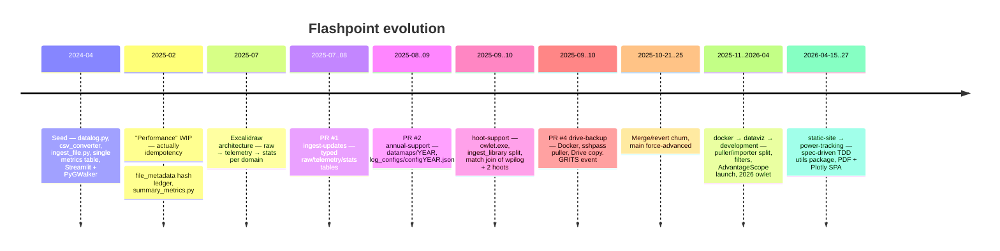
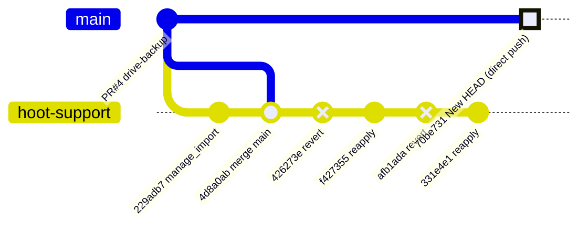

# 02 — Branch Survey & Alternate Approaches

The repository has 224 commits across 9 branches and 5 contributors (Joshua/Josh Reddick, TheGreatPintoJ, William Crouch, JK). About 150 commits of later work live on branches that were **never merged back to main** (IgniteRobotics, 2026).

## 1. Branch map

| Branch | vs main (main-only / branch-only) | Last commit | Status | One-liner |
|---|---|---|---|---|
| `main` | — | 2025-10-25 | Broken entry points | Pushed directly as "New HEAD with feature/hoot-support code" |
| `feature/ingest-updates` | 49 / 0 | 2025-08 | Merged (PR #1) | raw → telemetry → stats schema rewrite |
| `feature/drive-backup` | 15 / 0 | 2025-10 | Merged (PR #4) | Docker, puller, Drive backup |
| `feature/hoot-support` | 5 / 3 | 2025-10-25 | **Obsolete** | Merging it would delete the Docker stack |
| `feature/docker` | 0 / 14 | 2025-11-05 | Superseded | OS-specific owlet, first `ingest_dir.py` |
| `feature/dataviz` | 0 / 44 | 2026-04-02 | Superseded by development | Filters, AdvantageScope launcher, puller/importer split |
| `development` | 0 / 46 | 2026-04-25 | **Team's latest** | dataviz plus a practice-match regex fix |
| `feature/static-site` | 0 / 134 | 2026-04-27 | Superseded | `utils/` + SPA (has `test_site_builder.py`) |
| `feature/power-tracking` | 0 / 125 | 2026-04-26 | **Josh's latest** | `utils/` + PDF + SPA + Poetry + 111 tests |

`power-tracking` and `static-site` share no merge. Commit `5598702` copied files between them, and in doing so **dropped** the 249-line `test_site_builder.py`.

## 2. Timeline

## 3. Alternate approaches, side by side

```mermaid
flowchart TB
    subgraph A["main / development — 'warehouse' approach"]
      A1[puller: scp from roboRIO] --> A2[telemetry/ volume]
      A2 --> A3[importer: regex-sort per match]
      A3 --> A4[owlet + csv_converter → CSV.gz]
      A4 --> A5[pandas long → map → wide pivot]
      A5 --> A6[(SQLite robot.db)]
      A6 --> A7[Streamlit + PyGWalker]
      A7 -. "os.system" .-> A8[AdvantageScope on server]
    end
    subgraph B["power-tracking — 'report generator' approach"]
      B1[hoot files / --hoot-dir] --> B2[owlet → DataLogReader → wide DF]
      B2 --> B3[(hash-keyed CSV cache)]
      B3 --> B4[numpy MotorData / Match]
      B4 --> B5[PDF report]
      B4 --> B6[static JSON + Plotly SPA]
    end
```

| Dimension | Warehouse (main/development) | Report generator (power-tracking) |
|---|---|---|
| Goal fit ("life of the robot") | ✅ Accumulates across matches | ⚠️ Per-match artifacts; the manifest re-reads everything |
| Inputs | wpilog + drivetrain hoot + rio hoot, paired by regex | hoot only (TalonFX) |
| Storage | SQLite, everything TEXT, no indexes | CSV cache + JSON |
| Physics | Raw V/I/T/vel/pos stats | Power, energy, W/RPS, P95, thermal flags |
| Engineering | No tests or CI, `requirements.txt` is a pip freeze | Poetry, pytest strict markers, 10 specs + 8 plans |
| Deploy | Docker compose (broken on main; X11 hacks on development) | `python -m utils`; the site needs an HTTP server |
| Scale limit | Outer-join pivot, `SELECT *` into the browser | Sparse pivot (~235 MB per synthetic match), ~27 MB JSON per match |
| Offline at events | Needs the Docker host | ✅ Vendored Plotly |

**Verdict:** combine the two. Take the warehouse's accumulation model and semantic mapping, and the report generator's physics, tests, and offline static output. Rebuild the storage layer under both. See [05](05-target-architecture.md).

## 4. Per-branch notes

### `development` (supersedes `dataviz` and `docker`)
- **Three compose services:**
  - **puller:** scp only, deletion disabled (`origin/development:docker-services/puller/src/main.py:109-118`).
  - **importer:** sorts files into `telemetry/<MATCHID>/`.
  - **dataviz.**
- **owlet:** chosen by `platform.system()`, always the 2026 build (`origin/development:ingest_library.py:54-62`). The Linux binaries are x86-64 only, so they won't run on ARM hosts (Pi, Apple Silicon Docker).
- **Upsert attempt:**
  - The engine is created with `sqlite:///robot.db`, a relative path. It writes to the container's working directory, **not** the `db/` volume (`origin/development:ingest_library.py:403`).
  - Uniqueness is keyed on `filename` for tables that have no such column (`:404`).
- **Hard-coded years:**
  - `ingest_dir.py:54` passes `2026`, but `datamaps/2026/` doesn't exist.
  - `ingest_match_logs.py` still hard-codes `2025`.
- **viz:**
  - The cascading filters are cached with `st.cache_resource`, which is "shared across all users, sessions, and reruns" (Streamlit, n.d.). Filters only apply after Refresh, and one user's view leaks to the next.
  - AdvantageScope launches through `os.system` on the server host and needs X11/dbus/apparmor-unconfined in Docker.
- **Commit messages that reveal pain:** "Slight progress (BROKEN)", "AScope Broken", "Filters work now, you have to use refresh", "Cache pip install command (thank goodness no 10min buid times)". In Apr 2026 the regex was patched during an event.

### `power-tracking` / `static-site`
- **Spec-driven development:** specs live in `docs/superpowers/specs/2026-04-15…04-26`. Key decisions:
  - "Motor power" (V_motor × I_stator) is used as a torque proxy, and supply power as real battery draw.
  - Heatmaps over raw 50 Hz lines.
  - CSV input was dropped in favour of direct hoot.
  - Vendored Plotly for offline use at competitions.
- **Tests:**
  - **Results:** 111 pass and 5 skip (real-data tests, no `.hoot` fixtures). `static-site` has 124 pass and 1 stale failure.
  - **Not covered:** the SPA JavaScript, JSON size, `site_builder` on power-tracking, and any real end-to-end run.
  - **Undeclared dependency:** `msgpack` (needed by `datalog.py`) is missing from `pyproject.toml`. The tests pass only because conversion is mocked.
- **Committed by mistake:** `.claude/settings.local.json`, `.superpowers/brainstorm/*.pid`, and `.python-version` pinned to a local virtualenv name.

### `hoot-support`
- Its unique work (`manage_imports.py`, the `os.path.basename` fix) is already on main through `70be731`.
- The branch keeps a revert that removes 18 Docker/backup files.
- **Delete it.**

### History worth knowing
- `0df7fa6` "wip on performance updates" was **idempotency** work: a SHA-256 ledger and two-phase success flags. It did not touch speed.
- DuckDB has been pinned in `requirements.txt` since 2025 but **was never imported**.
- `ingest_file.py` was renamed to `ingest_rio_log.py`, then to `ingest_library.py`. PR #4 was branched before the rename and kept calling `ingest_file.py`. Git couldn't flag this semantic conflict, and with no CI nothing else caught it either.

## 5. Merge/revert churn on main (Oct 21–25, 2025)

**Lesson:** reverting a merge commit was used as an undo button, then main was pushed directly with no PR. The rewrite needs protected `main`, required CI, and a smoke test that runs each entry point.

## 6. What to salvage

| Keep (idea or code) | From | Why |
|---|---|---|
| SHA-256 import ledger with two-phase success | `legacy-2025:ingest_system_log.py`, `ingest_library.py:18-33` | The right idempotency primitive |
| raw → processed → stats layering | `docs/data_arch.excalidraw` | Maps onto a medallion layout |
| FMSInfo + git metadata extraction | `legacy-2025:ingest_library.py:148-184` | Match and code provenance |
| Practice-aware match regex | `origin/development:docker-services/importer/main.py:8` | Matches WPILib naming (WPILib Developers, 2026b) |
| Power/energy/W/RPS/thermal math + tests | `origin/feature/power-tracking:utils/analyzer.py`, `tests/utils/*` | Domain logic, already specified and tested |
| TOML name map with competition overrides | `origin/feature/power-tracking:utils/motors.toml`, `names.py` | Better than per-year CSV |
| Offline static SPA concept | `origin/feature/power-tracking:utils/templates/index.html` | Works at events with no internet |
| Per-OS/per-year owlet set | `origin/development:executables/` | Needed; select by log version, not path |
| **Discard** | | |
| Vendored `datalog.py`, CSV round-trip | main | Use the official compiled reader (RobotPy, n.d.) |
| Wide outer-join pivots | both | Use long format plus as-of joins |
| sshpass/scp puller, server-side AdvantageScope | main/development | Use SFTP and download links |
| Binaries in git history | all | ~20 MB and growing every season |
