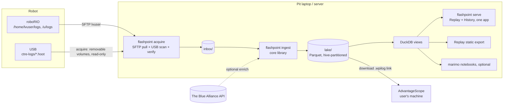
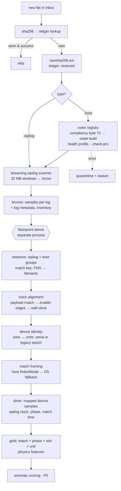
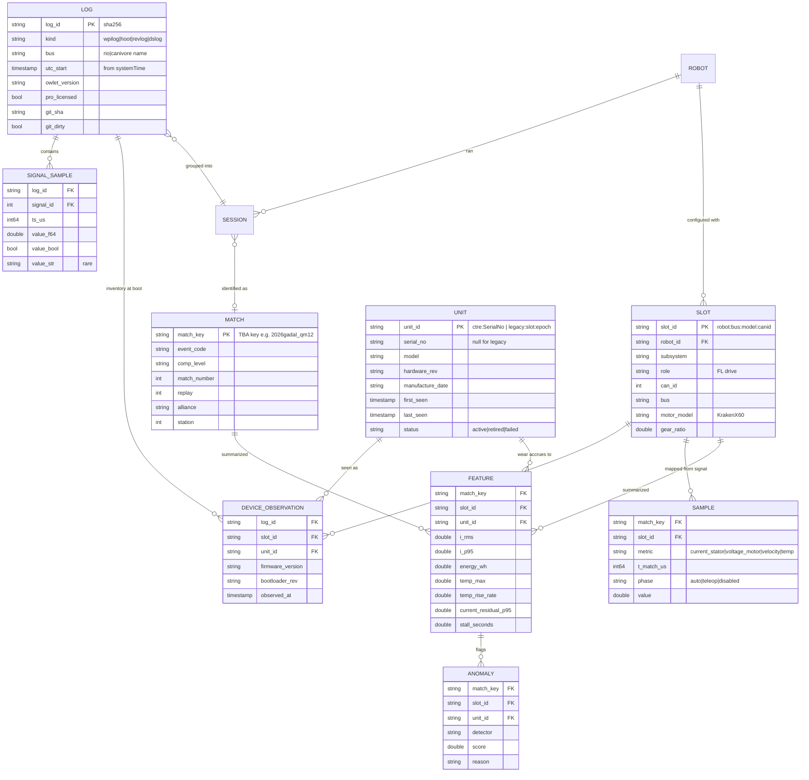

# 05 — Target Architecture

This is a proposal, not a decision. Decisions that need a call from Josh and the team are marked **⚖️**.

## 1. Principles

1. **One library, many front-ends.** All parsing, framing, mapping, and physics live in a typed, tested core package. The CLI, the ingest service, notebooks, and site builders are thin shells around it. This is the opposite of today's eight copy-pasted scripts.
2. **Raw is immutable; everything else can be rebuilt.**
   - Original `.wpilog`/`.hoot` files are stored by content hash and never modified.
   - Every derived table can be regenerated with `flashpoint rebuild`.
   - This replaces the cache-staleness bugs (#24) and the partial-import bugs (#17).
3. **Long format at rest, as-of joins on read.** Never outer-join sparse signals on exact float timestamps (#14, #36, #38).
4. **Configuration is data.** Season, robot, CAN map, and owlet version are resolved from config plus in-log metadata. Nothing is hard-coded (#15, #66).
5. **Track physical units, not CAN IDs.** A **slot** is a role on a robot, such as "FL drive, CAN 11, rio bus". A **unit** is a physical device, identified by its CTRE factory serial number.
   - Every robot logs a CAN inventory at startup (see [99](99-ctre-device-serial-numbers.md) and §4a).
   - With that inventory, a unit's wear history follows it through swaps, rebuilds, and moves between robots.
6. **Use official tooling.** Use RobotPy `wpiutil.log` (RobotPy, n.d.) and an owlet registry modelled on AdvantageScope (Mechanical Advantage, 2026). Hand single-log deep dives to AdvantageScope.
7. **Offline-first at events.** Everything runs on one laptop with no internet. TBA enrichment is opportunistic.

## 2. System context



## 3. Ingest pipeline



Implementation notes (P1 + P2, 2026-10-04):
- Ingest and derive run in separate processes so peak memory is the larger of the two, not their sum (Q7: 870 MB and 593 MB).
- Derive is fingerprinted per session, so a repeat run is a no-op. `--all` forces a rebuild.
- Alignment: see ADR-0012. Identity: see ADR-0011.

## 4. Data model (lake layout)

```
lake/
  raw/<sha256>.{wpilog,hoot}                       # immutable originals
  bronze/samples/season=2026/log_id=<sha>/part-0.parquet   # sorted per row group (P1)
  silver/samples/season=2026/session_id=<id>/part-*.parquet          # P2: one per hoot in the session
  silver/signals/season=2026/session_id=<id>/part-0.parquet          # declared NT signals (wpilog only)
  gold/match_features/season=2026/session_id=<id>/part-0.parquet      # P2
  gold/anomalies/season=2026/part-0.parquet
  meta/flashpoint.sqlite (ledger, WAL)  meta/*.parquet (snapshots: files, logs, hoot_logs, entries, inventory)
  meta/units.parquet   meta/device_observations.parquet   # physical-device registry
config/
  seasons/2026.toml        # NT roots: robot, photonvision, camera_publisher, preferences, fms
  robots/2026-comp.toml    # slots: (bus, model, CAN id) → subsystem/role, gear ratio, motor model;
                           # signals: (season root, NT entry) → id, subsystem, component, metric
```



**Why this shape.**
- **Bronze** is a faithful long-format copy of every record. It is typed: there are no stringly-typed values (#31).
- **Silver** is long too, so as-of joins happen at query time, either DuckDB ASOF (DuckDB Foundation, n.d.-c) or Polars `join_asof` (Polars, n.d.).
- **Gold** is small and wide: one row per (match, slot, unit). Lifetime trend queries and anomaly models read only this layer.
- Partitioning by `season/event` gives DuckDB file and zonemap pruning (DuckDB Foundation, n.d.-b).

### 4a. Device identity: slot vs. unit

**The problem.** Phoenix 6 gives robot code no way to read a serial number. `CommonDevice` exposes `device_id`, `device_hash`, and `network`. The hash is "a number unique for this device's hardware type and ID. This number is not unique across networks" (CTR Electronics, n.d.-g). Hoot logs key signals the same way, as `Phoenix6/TalonFX-11/...`. If a motor is swapped and the replacement keeps CAN ID 11, signals alone cannot tell the two units apart.

**The fix.**
- Tuner X shows a factory **Serial No** for each device (CTR Electronics, n.d.-e). It gets this from the Phoenix Diagnostics Server, which runs with the robot program on port 1250 (CTR Electronics, n.d.-f).
- CTRE's Phoenix 5 documentation says this HTTP API "can potentially be used by third-party software, or even the robot application itself" via `?action=getdevices` (CTR Electronics, n.d.-h).
- The team will add a robot-side **CAN inventory logger** to every robot. The design is in [99-ctre-device-serial-numbers.md](99-ctre-device-serial-numbers.md) (IgniteRobotics, 2026).

**Logging contract** (the robot-code side; ingest depends on it):

| Item | Value |
|---|---|
| Where | **wpilog** `/Flashpoint/CANInventory` (string, JSON) through `DataLog`/`DataLogManager`. Optionally also mirrored to hoot as a custom signal, since custom signals export without Pro (CTR Electronics, n.d.-a) |
| When | Once after devices enumerate, while disabled, in a background thread. Re-check on each entry to Disabled (never while enabled) and re-log only if the payload changed (a hot-swap in the pit). Implemented in Robot-2026#107 and Phoenix-2026#12 |
| Payload | `{"schema":1,"source":"phoenix-diag","devices":[{"model","bus","id","serial","fw","hw_rev","boot_rev","man_date"}]}`. Normalize to this shape on the robot, so ingest doesn't depend on the diagnostics server's field names |
| Failure | Log `{"schema":1,"error":"..."}`, never crash robot code. Ingest then falls back to legacy identity |

**Ingest rules.**
1. Parse the inventory entry and produce one `DEVICE_OBSERVATION` per device, with `unit_id = ctre:<serial>`.
2. Resolve the slot by joining `(robot, bus, model, can_id)` to the robot config.
3. Use the **last inventory before match start** for the session. If two inventories in one log disagree, a swap happened mid-session: split the features at that timestamp and flag it.
4. **Legacy logs** (2024–2026, no inventory) get `unit_id = legacy:<slot_id>:<epoch>`. The epoch increments at swap dates declared in the robot config (`[[slots.swaps]] date=...`). If no swaps are declared, the whole history is one epoch. Expect lower confidence here.
5. A serial seen in a new slot or a new robot keeps its history. Baselines are computed **per unit**, and comparisons between siblings are made **per slot**.
6. **Unmapped serials** (a device in the inventory with no slot in config) raise a `doctor` warning rather than being silently dropped (#11).

**What this enables.**
- Per-motor lifetime odometry: hours, Wh, thermal cycles, and stall-seconds per physical unit.
- "This Kraken has 40% more stall time than any other unit we own."
- Spare-motor rotation, and failure attribution that holds up across rebuilds and between the practice and comp robots.

**Scope.** This covers CTRE devices only. REV devices (SPARK, via the Status Logger) need their own inventory source (REV Robotics, n.d.). Until one exists, model them with legacy identity.

## 5. Package layout (Python 3.11+, Poetry, pytest strict markers)

```
flashpoint/
  pyproject.toml
  src/flashpoint/
    readers/      wpilog.py (compiled streaming scanner), hoot.py (owlet registry + owlet-manifest.toml), dslog.py, revlog.py
    identity/     match.py (FMSInfo/filename/TBA), session.py (time-overlap grouping),
                  inventory.py (CANInventory → slot/unit resolution)
    config/       models.py (pydantic), loader.py (TOML)
    lake/         ledger.py, bronze.py, silver.py, gold.py, paths.py
    physics/      motor_models.py (DCMotor constants), power.py, residuals.py
    anomaly/      rules.py, baseline.py (robust z), models.py (PyOD/River)
    acquire/      config.py, pulls.py, robot.py (paramiko), transfer.py, volumes/ (macos, linux, windows),
                  removable.py, cycle.py, watch.py, backup.py (rclone)
    report/       envelope.py, markers.py, build.py (per-match data + index), export.py (static)
    views/        queries.py (parameterised DuckDB SQL behind the History API)
    web/          server.py (stdlib HTTP), api.py; static/ (shell, views/, vendor/uplot, fonts)
    cli.py        argparse: acquire | backup | restore | ingest | derive | rebuild | report | serve | doctor
  tests/          unit/, golden/ (real small logs + expected parquet), e2e/
  notebooks/      README + example marimo notebook over views/queries.py (optional)
  tools/          fetch-corpus.py, update-owlet-manifest.py (owlet binaries are never in git)
```

## 6. Key decisions

| ⚖️ | Decision | Recommendation | Alternatives and trade-off |
|---|---|---|---|
| D1 | Storage | **Parquet lake + DuckDB** | SQLite (simple, but a row store); TimescaleDB (needs a server, better for concurrent writes) |
| D2 | Transform engine | **Polars** (+ DuckDB SQL) | pandas: familiar to students, about 90× slower on the vendor benchmark (Polars, 2025) |
| D3 | wpilog reader | **`robotpy-wpiutil`** | Vendored `datalog.py`: no build dependency, pure-Python speed |
| D4 | owlet distribution | **Fetch script + checksum manifest, cached under `~/.cache/flashpoint/owlet/`. Select by hoot `--compliancy`** | Commit binaries (today: repo bloat); Git LFS |
| D5 | Temperature source | **Hoot `DeviceTemp`. P0 confirmed the logs are Pro-licensed. Record `pro_licensed` per log** | Robot-side NT logging (fallback only) |
| D6 | Per-match UI | **Replay view with a static export** generated from gold/silver (canvas UX, ~1000-bucket envelopes, payload ≤ 2 MB; ADR-0006 amended) | Streamlit (server, cache pitfalls) |
| D7 | Lifetime UI | **History view in one local app** (`flashpoint serve`, DuckDB API; ADR-0013 supersedes the marimo plan) | marimo (can't render the canvas shell); Grafana + DuckDB plugin (glibc server, unsigned plugin); Streamlit |
| D8 | Deep dive | **Link to AdvantageScope**: a guarded one-click launch on the machine running `serve` (ADR-0014), otherwise download the raw logs | Rebuild graphs (don't) |
| D9 | Deploy | **`pipx install` + per-user services** (systemd user unit, Windows scheduled task; container deferred) | Three-service compose (today) |
| D10 | Anomaly v1 | **Rules + robust z-score vs per-unit history + DCMotor residual** | Jump to ML (not enough data in season 1) |
| D11 | Device identity (**decided**) | **Serial-number units from the robot-logged CAN inventory, plus config-declared legacy epochs** | CAN-ID only (swaps corrupt baselines); manual maintenance log only |

## 7. Shrinking the per-match payload (fix for #37)

**[P4, measured]** Implemented differently from the plan below: about **1000 min/max/mean buckets** per match window (bucket width rounded up to 10 ms; Q7 ≈ 170 ms), temperature as change points, 3 significant figures, delivered as script files so they load from file://. Q7 is 1.07 MB. Fixed 10 ms bins measured 20 MB for Q7 and were dropped. See ADR-0006 (amended) and ADR-0013.


**[Background — engineering estimate]**
- Store silver as Parquet and have the static site read it, either from JSON pre-binned per **10 ms with min/max envelopes** or through DuckDB-WASM over Parquet.
- Round to 3 significant figures and drop energy arrays (compute them client-side from power).
- **Downsample with min/max** rather than `[::step]`, so current spikes survive (#25).
- Target ≤ 2 MB per match.
- Bundle a tiny `serve.py` (or `python -m http.server`) since `fetch()` needs HTTP (#59).
