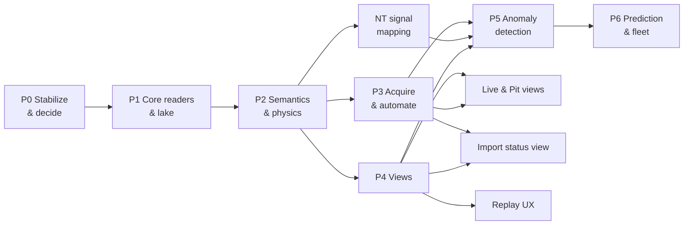
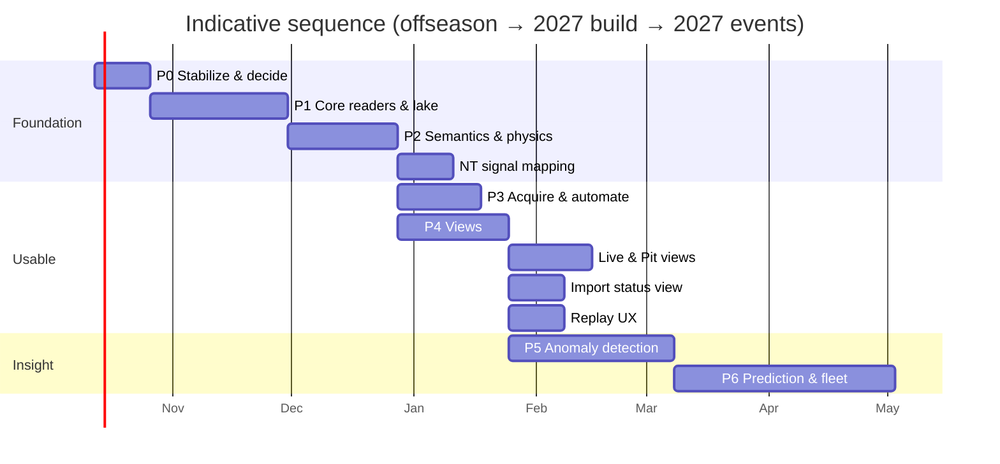
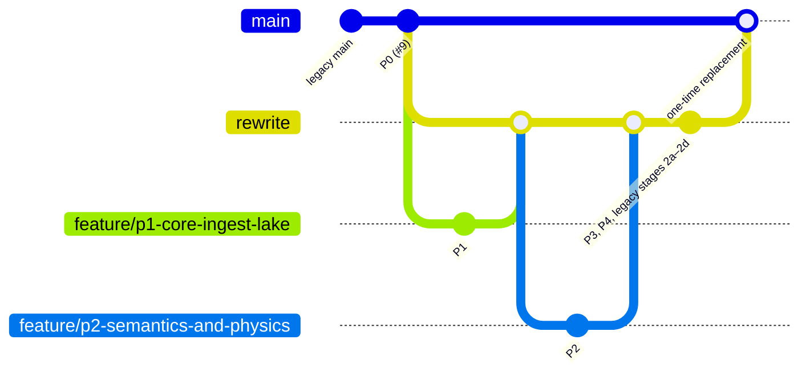

# 06 — Rewrite Roadmap

Phases are ordered by dependency, not by calendar. Each phase ends with something usable at a competition. Sizes are relative (S/M/L), because team availability drives the dates.

## 1. Overview

## 2. Phases

### P0 — Stabilize & decide (S)
> **Status: in progress** (started 2026-10-04). Done: CI skeleton, tags, ADRs (D1–D10 Proposed, D11 Accepted), corpus-v1, Pro/compliancy findings, robot inventory logger PRs (Robot-2026#107, Phoenix-2026#12), retire-legacy-code stage 1. Open: [HUMAN] verify `getdevices` field names on a live robot, confirm `/Flashpoint/CANInventory` in fresh logs, Tuner X unit walk, team review of the ADRs. Tracked in `openspec/changes/p0-stabilize-foundation/tasks.md`.

- **Repo:**
  - Tag the current `main` as `legacy-2025`.
  - Archive the branches under `archive/*`: `development`, `power-tracking`, `static-site`, `dataviz`, `docker`.
  - Delete `hoot-support`.
  - Protect `main` and require PRs plus CI.
- **Decisions:** make the calls D1–D11 in [05 §6](05-target-architecture.md#6-key-decisions). Record each as a short ADR in `docs/adr/`.
- **Golden corpus:** pick about 6 real logs and commit them through LFS or a fetch script.
  - one qual wpilog, plus its rio and CANivore hoots
  - one practice log
  - one non-FMS log
  - one log with a corrupt tail
  - one 2025 log and one 2026 log (owlet versions)
- **Robot-side CAN inventory logger (all robots):** implement the contract in [05 §4a](05-target-architecture.md#4a-device-identity-slot-vs-unit) and [99](99-ctre-device-serial-numbers.md).
  - First open `http://<rio>:1250/?action=getdevices` against the current Phoenix 6 robot to confirm the field names. The only documented example is from Phoenix 5 (CTR Electronics, n.d.-h).
  - Ship it before the next practice session, because every log recorded without it becomes a legacy-identity log.
  - Back-fill a `units` seed: walk each robot and spare shelf with Tuner X, record each serial against its slot, and label the motors physically.
- **Pro check:** run `owlet --check-pro` (Mechanical Advantage, 2026) on the corpus. ✅ Done 2026-10-04: all hoots are Pro-licensed (ADR-0005). `--compliancy` was also found to be the owlet selection key (ADR-0004).
- **Exit:** ADRs merged, corpus available, CI skeleton green, `/Flashpoint/CANInventory` present in a fresh log from every robot.

### P1 — Core readers & lake (L)
> **Status: ✅ done** (2026-10-04). Merged into `rewrite` (#11) and archived (`openspec/changes/archive/2026-10-04-p1-core-ingest-lake`). Its specs are now the baseline in `openspec/specs/`. Measured: full Q7 match ingested in 5.6 s with a 862 MB peak (budget 30 s / 1 GB); reader at 20 M records/s, matching the official WPILib reader exactly; all 15 corpus files handled (14 ingested, 1 real 0-byte hoot quarantined, 3 integrity warnings). Revised decisions: ADR-0001, 0003, and 0004 updates.

- **wpilog reader** on `robotpy-wpiutil` (RobotPy, n.d.). Stream it into Arrow record batches and write bronze Parquet. Handle struct-typed entries (WPILib Developers, 2023).
- **owlet registry:**
  - `(phoenix_api_version, os, arch) → binary`, with checksums and lazy download.
  - Pick the version by probing the hoot. Fail loudly on version mismatch (CTR Electronics, n.d.-c).
  - Build a multi-arch container (fixes the x86-only Linux binaries).
- **Ledger:** content hash with `received` → `bronze` → `silver` → `gold` → `success` states plus `pipeline_version`, and quarantine on error. This ports the idea from `legacy-2025:ingest_system_log.py`.
- **Metadata extraction:** FMSInfo (WPILib Developers, 2026a), git metadata, and `systemTime` anchoring (WPILib, n.d.-a).
- **CLI:** `flashpoint ingest PATH...` and `flashpoint doctor` (environment, owlet, and Pro checks).
- **Exit:**
  - The golden corpus ingests byte-for-byte reproducibly.
  - Re-ingesting is a no-op.
  - Ingesting a full qual match **(wpilog + 2 hoots) takes under 30 s and under 1 GB RAM** on a pit laptop. Benchmark it in CI.

### P2 — Semantics & physics (M)
> **Status: ✅ done** (2026-10-04). Merged into `rewrite` (#13) and archived (`openspec/changes/archive/2026-10-04-p2-semantics-and-physics`). Its specs are now the baseline in `openspec/specs/`.
> - **Q7:** aligned by payload-match (offset 19.5635 s, IQR 76 µs); 22 devices mapped to slots and units; gold has 17 motors × {auto, teleop, match}.
> - **Budget:** ingest + derive 10.5 s; peak 870 MB (ingest) and 593 MB (derive).
> - **Follow-up:** NetworkTables-only signal mapping (subsystem telemetry, vision) is a future change; legacy stage 2b-ii waits on it.

- **Config:**
  - Season TOML and robot TOML, validated with pydantic.
  - Generated from today's `datamaps/*.csv` and `utils/motors.toml` by a one-off migration script. Fix the `Pheonix6` typo during migration.
- **Match identity resolver:** FMSInfo, then the filename regex (one implementation, covering `P|Q|E` per WPILib Developers, 2026b), then an optional TBA key lookup (The Blue Alliance, n.d.).
- **Session grouping:** pair the wpilog and hoots by time overlap.
- **Device identity:** add `identity/inventory.py`.
  - Map the CANInventory entry to `DEVICE_OBSERVATION`, `UNIT`, and `SLOT`, detect mid-session swaps, and assign legacy epochs for old logs.
  - `doctor` reports unmapped serials and slots with no observation.
- **Match phases:** auto, teleop, and disabled, taken from DS enable and autonomous flags. Fixes #13.
- **Physics:** port `analyzer.py` from power-tracking, along with its tests, onto Polars:
  - Use time-weighted means.
  - Don't zero-fill before the first sample.
  - Keep velocity signed.
  - Fixes #23, #26, #27.
- **DCMotor residuals:** expected current from motor constants (WPILib, n.d.-c) and the configured gear ratio.
- **Gold:** the `match_slot_features` table, keyed by match, slot, and unit.
- **Exit:** power-tracking's numbers reproduce within tolerance on the corpus. The gold table answers "max temp of every drive motor at GADAL" and "lifetime Wh for serial X across all robots" in under 1 s in DuckDB.

### NetworkTables signal mapping (S–M, follow-up to P2)
> **Status: implemented; 2026 signal list awaiting sign-off** (change `nt-signal-mapping`, branch `feature/nt-signal-mapping`).
> - **Built:** `config/seasons/<year>.toml` (five NT roots) and `[[signal]]` tables in robot configs. Derive writes `silver/signals/` and lists declarations that are absent or non-numeric in `meta_missing_signals`.
> - **2025:** migrated from the `legacy-2025` tag against corpus Q30. Of 24 metrics rows (not 28), 6 are mapped and 18 motor rows are superseded by CAN slots. 33 of 36 vision rows are mapped; the 3 `targetPose` structs are non-numeric. Of the `config2025.json` prefixes, 5 become roots and `MetaData` is reported.
P2 mapped CAN devices (slots and units) into robot config, and deliberately left out signals that only exist in NetworkTables: subsystem telemetry the robot code publishes, and vision. They are still described only by legacy files, which is the last thing blocking `retire-legacy-code` stage 2b-ii.
- **Season config:** add `config/seasons/<year>.toml` (planned in `05-target-architecture.md`, not built yet) with the NT prefixes from `log_configs/config2025.json`: metrics, preferences, FMS, PhotonVision, and CameraPublisher.
- **Robot config:** NT entries get the same labels as CAN slots (subsystem, assembly, subassembly, component, metric), from `datamaps/2025/metrics_map.csv` (28 rows). Cameras and their metrics come from `datamaps/2025/vision_map.csv` (36 rows).
- **Migration:** extend `tools/migrate-legacy-config.py`, which reads from the `legacy-2025` tag. **2024 is out of scope** (decided 2026-10-06): there is no 2024 robot config, and the 2024 maps and log config stay recoverable from the tag.
- **Derive:** label NT signals in silver alongside slot signals, so Replay tracks, History, and P5 rules can use subsystem telemetry (for example the 2025 corraler motor current and voltage).
- **Exit:** every row of the two 2025 maps and every prefix in `config2025.json` is covered by config, verified by a test against the tag. `retire-legacy-code` 3b can then delete `datamaps/` and `log_configs/`.

### P3 — Acquire & automate (S)
> **Status: implemented; human verification pending** (change `p3-log-acquisition`, branch `feature/p3-log-acquisition`). Open: the live-roboRIO task (throughput, `sha256sum` on the rio), a real USB stick on Linux and Windows (macOS passed 2026-10-05), the Windows service, and the Windows CI job (group 9, still pending). The container moved out of P3 (ADR-0009 amended).

- **SFTP puller** (paramiko or asyncssh, [Background]):
  - copies to the inbox, verifies size and hash, and **never deletes on the robot by default**;
  - is aware of rotation: warn when robot free space is under 100 MB, since WPILib and Phoenix prune at 50 MB (WPILib Developers, 2026b; CTR Electronics, n.d.-a).
- **Removable media:** USB sticks (macOS, Linux, Windows) are a pull source next to the robot, read-only and hash-verified. Manual inbox drops still work.
- **Watcher:** `flashpoint acquire --watch` cycles robot, volumes, ingest, derive and backup.
- **Packaging:** a systemd user unit with a correct `ExecStart` (#7) and a Windows scheduled task. Windows is supported. The container is deferred out of P3.
- **Backup:** `rclone` copy of `lake/raw` (immutable) and a `lake/meta` snapshot [Background]. Replaces `drive-backup.py`.
- **Exit:** plug in the robot, and within 5 min its matches show up in the views, unattended.

### P4 — Views (M)
> **Status: done; archived 2026-10-05** (change `archive/2026-10-05-p4-views-and-reports`, merged into `rewrite` as #23). Built to Josh's canvas "Flashpoint UI Prototypes": one local app (`flashpoint serve`, ADR-0013 supersedes the marimo plan) with **Replay** (≈1000-bucket envelopes, Q7 = 1.07 MB, rule markers, compare overlay, static export via `flashpoint report --static`) and **History** (per-unit and per-slot trends, odometry from the new `gold/unit_usage`, lifelines). Stall threshold moved to 0.2 of stall current on corpus evidence. Human checks passed 2026-10-05: static export from a USB stick with Wi-Fi off, serve with History-to-Replay drill-through and the AdvantageScope round-trip, and Josh's sign-off on the look. The plan below is the original scope.

- **Per-match static site:**
  - Rebuild the power-tracking SPA on silver and gold.
  - Payload ≤ 2 MB per match with min/max envelopes.
  - Escape all values (#56).
  - Ship a `serve` command.
  - Add an "Open in AdvantageScope" download link for the raw wpilog (Mechanical Advantage, n.d.-a).
- **Lifetime app** (marimo, per marimo, n.d.):
  - per-slot **and per-unit** trend lines across matches, events, and robots;
  - a unit page with odometry (hours, Wh, thermal cycles, stall-seconds) and the slot history the serial has occupied;
  - filters push down to DuckDB SQL instead of loading the whole table (#35).
- **Optional:** Grafana with the DuckDB plugin on the pit server (MotherDuck, n.d.).
- **Exit:** a drive coach can answer "is FL-drive running hotter than last event?" in two clicks, offline.

### AdvantageScope launch (S, follow-up to P4)
> **Status: done; archived 2026-10-06** (change `archive/2026-10-06-advantagescope-launch`, merged as #25, ADR-0014). In local `serve`, Replay and History open a match's wpilog in AdvantageScope with one click, from hard-linked readable names, with the hoots staged for File › Insert log. Shared on the network and in static exports, it is download only. Field-checked on macOS 2026-10-06: one-click open works, and Insert log lines the hoots up with the wpilog. Install paths confirmed on Linux and Windows.

### Live & Pit views (M, follow-up to P4)
The canvas's **Live** and **Pit** boards read the robot, not the lake, so P4 left them out. They become one change after P4 and P3:
- an NT4 client (or a small relay so one robot connection serves many viewers) feeding Live at about 2 Hz;
- the Pit board's checks and GO / DECIDE / NO-GO verdict;
- both as views in the P4 shell: one file in `web/static/views/` and one `FP.view` call each, no restyling.
- **Needs first:** data sources for pit spin-test current, fault counts, firmware events, and batteries (none are logged today), and a decision on whether views may write (notes, swaps, pit tasks); P4 views are read-only.

### Import status view (S–M, follow-up to P3 and P4)
A view in the P4 shell that answers three questions about the lake: **are we missing logs, did they all import clean, and do the clocks line up?** Most of the data is already in the ledger. Little of it is visible today outside `flashpoint doctor` and SQL.
- **Missing logs:**
  - per session: expected buses (from the robot config) against the hoots actually grouped in `session_hoots`, so a session with a wpilog but no CANivore hoot stands out;
  - per event: gaps in the match sequence (Q1…Qn from FMS info or filenames). The Blue Alliance schedule fills in the expected list when online, which stays optional;
  - files seen by `acquire` (`pulls`) that never reached `success`.
- **Clean import:**
  - `files.stage`, `reason` and `warnings` (quarantined, `incomplete-read`, `short-coverage`);
  - `logs.truncated_bytes` and `orphan_records`, `hoot_logs.read_status` and `integrity`;
  - `unmapped_devices` and logs with no CAN inventory (legacy epochs);
  - **new:** record when owlet exports of a hoot differed in size (#17 tail loss). Today that is only a log line, so it can't be counted.
- **Timing:**
  - per hoot: `session_hoots.offset_us`, `method`, `confidence`, `spread_us`, `bus_agreement_us`, with low-confidence or disagreeing alignments flagged;
  - per wpilog: `anchor_source` and `utc_offset_us`, flagging logs anchored by fallback instead of `systemTime`;
  - framing: matches whose `match_phases` came from a fallback source.
- **Shape:** a table per event, one row per match, a status light per check, and drill-through to Replay and AdvantageScope. It is read-only, like the other P4 views. Re-ingest or re-derive stays on the CLI.
- **Exit:** after an event, a student can see in one screen which matches are missing logs, which imported with warnings, and which have suspect clock alignment, without SQL.

### Replay UX (S, follow-up to P4)
Two improvements to the Replay board:
- **Match list filters:** filter the left match list by season (year), robot, and competition (event). The filters combine, live in the URL like the rest of Replay's state, and default to the most recent event. The static export filters the same way over the matches it contains.
- **Timeline zoom:** zoom in and out on the Replay timeline (buttons, scroll or pinch, and drag to select a range), with every track and marker following the same window. Envelopes are about 1000 buckets per match (about 0.15 s each for a full match), so:
  - zooming within that resolution works everywhere, including the static export;
  - finer detail needs `serve` to fetch higher-resolution envelopes for the visible window from silver. Static exports stop at bucket resolution and say so;
  - single-sample detail stays in AdvantageScope (D8: link, don't rebuild).
- **Exit:** a drive coach finds a match by year, robot, and event in two clicks, and can zoom to a two-second brownout without leaving Replay.

### P5 — Anomaly detection (L)
- **Tier 1, rules:**
  - temperature thresholds (port 55 °C avg / 65 °C max);
  - stall seconds (high current at near-zero velocity);
  - CAN dropout and brownout counts (needs the DS log reader, LigerBots, 2026);
  - current residual P95 above a threshold.
- **Tier 2, baselines:**
  - robust z-score (median/MAD) of each gold feature against that **unit's** own history. A swapped-in unit starts its own baseline automatically;
  - also compared against the sibling **slots** (the 4 drive motors should look alike).
- **Tier 3, models:**
  - IsolationForest (scikit-learn developers, n.d.) or PyOD detectors (Zhao et al., n.d.) on gold feature vectors;
  - River HalfSpaceTrees for online scoring (River developers, n.d.);
  - STUMPY discords on silver current traces to catch odd shapes (STUMPY developers, n.d.).
- **Output:** an `anomalies` table, badges in the views, and an optional Slack or Discord webhook.
- **Exit:**
  - Backtest on the 2025–2026 logs flags at least one known real failure (team pit notes are the ground truth).
  - False-positive rate is low enough that students don't learn to ignore it.

### P6 — Prediction & fleet (L, stretch)
- Label failures from pit notes and maintenance records to make a `maintenance_events` table keyed by **serial number**. Unit identity makes these labels reliable.
- Model time to failure or degradation slopes per component (thermal rise rate, residual drift). Literature shows measurable current and speed shifts before faults (Jin et al., 2014).
- Optionally pool data across robots or teams. That needs the robot config to be portable.

## 3. Migration of existing assets

| Asset | Action | Phase |
|---|---|---|
| Raw logs on Drive / `telemetry/` | Bulk `flashpoint ingest` into `lake/raw` (dedup by hash) | P1 |
| `db/robot.db`, GRITS.db | **Don't migrate.** Rebuild from raw. Keep as a read-only archive | P1 |
| `datamaps/*.csv`, `log_configs/*.json`, `utils/motors.toml` | Script → `config/seasons/*.toml`, `config/robots/*.toml` | P2 (device maps); NT signal mapping (NT maps, log configs) |
| power-tracking `analyzer.py` + tests | Port to Polars; keep the test cases as golden expectations | P2 |
| power-tracking SPA + specs | Reference only; the canvas sets the UX (Replay + History, ADR-0013) | P4 |
| `development` match regex | Becomes the single filename-fallback parser | P2 |
| Known motor swaps (pit notes, memory) | Declare as `[[slots.swaps]]` dates in robot TOML → legacy unit epochs | P2 |
| Excalidraw diagrams | Replace with the mermaid diagrams in these docs | P0 |

## 4. Branching

- `rewrite` is the integration branch, cut from `main` after P0 (2026-10-04).
- Every phase and every legacy-removal stage is a `feature/*` branch from `rewrite`, merged back through a PR with CI. `rewrite` is protected like `main`.
- `main` stays on the legacy code (plus P0's docs and CI) until the rewrite is ready. Then `rewrite` merges into `main` once, replacing the legacy code entirely.
- Keep `rewrite` current with any `main` hotfixes by merging `main` into `rewrite`. Never rebase it; it's shared.

## 5. Quality gates (every phase)

- **CI:** `pytest --strict-markers`, coverage on `src/flashpoint/{readers,lake,physics}` ≥ 85%, ruff, mypy `--strict`.
- **Golden-corpus E2E** on every PR. Add a perf budget check from P1 onward.
- **Container builds:** amd64 and arm64.
- **Docs:** the ADR log is updated when a decision changes.

## 6. Risks

| Risk | Likelihood | Impact | Mitigation |
|---|---|---|---|
| ~~Logs are not Pro, so no hoot temperature~~ | Retired | — | P0 confirmed the logs are Pro-licensed (ADR-0005). `doctor` flags any log that isn't |
| owlet / Phoenix format changes mid-season | Medium | High | Registry plus `doctor`. Pin the robot's Phoenix version during events |
| Logs rotate out before they're pulled | Medium | High | P3 free-space alerts. A USB drive on the robot |
| Student turnover leaves the code unmaintained | High | Medium | Small core, typed, tested, ADRs, marimo notebooks as the on-ramp |
| Diagnostics server not reachable or schema changes, so no inventory | Medium | High | Normalize on the robot (contract schema v1), never crash, log an error payload. `doctor` alerts on logs with no inventory. Fall back to legacy epochs |
| Too few failures to learn from | High | Medium | Lean on Tier 1 and 2 (physics and baselines). ML is optional |
| Scope creep into rebuilding AdvantageScope | Medium | Medium | D8: link, don't rebuild |

## 7. Odds

**[Background]** My honest estimate is that P0–P4 delivers a working tool by the 2027 events. Doing the first five phases before anomaly detection beats trying to bolt ML onto today's pipeline. Today's storage and joins return wrong numbers (#10–#27), so a model trained on them would learn the bugs.
