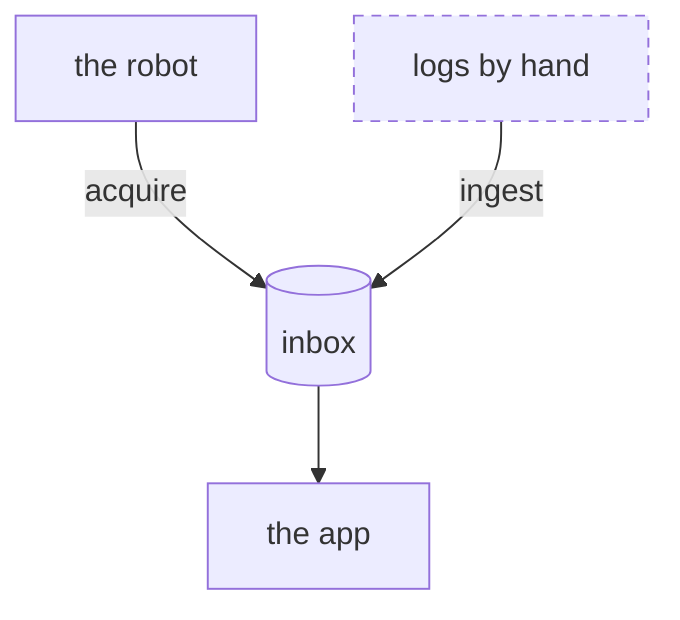

# A page with a tagged diagram

```mermaid
flowchart TB
    classDef outside stroke-dasharray:5 4
    R[the robot]:::robot -->|acquire| I[(inbox)]
    M[logs by hand] -->|ingest| I
    I --> APP[the app]
    class I data
    class M outside
    class APP step
```

  a step
  data
  the robot
  outside

